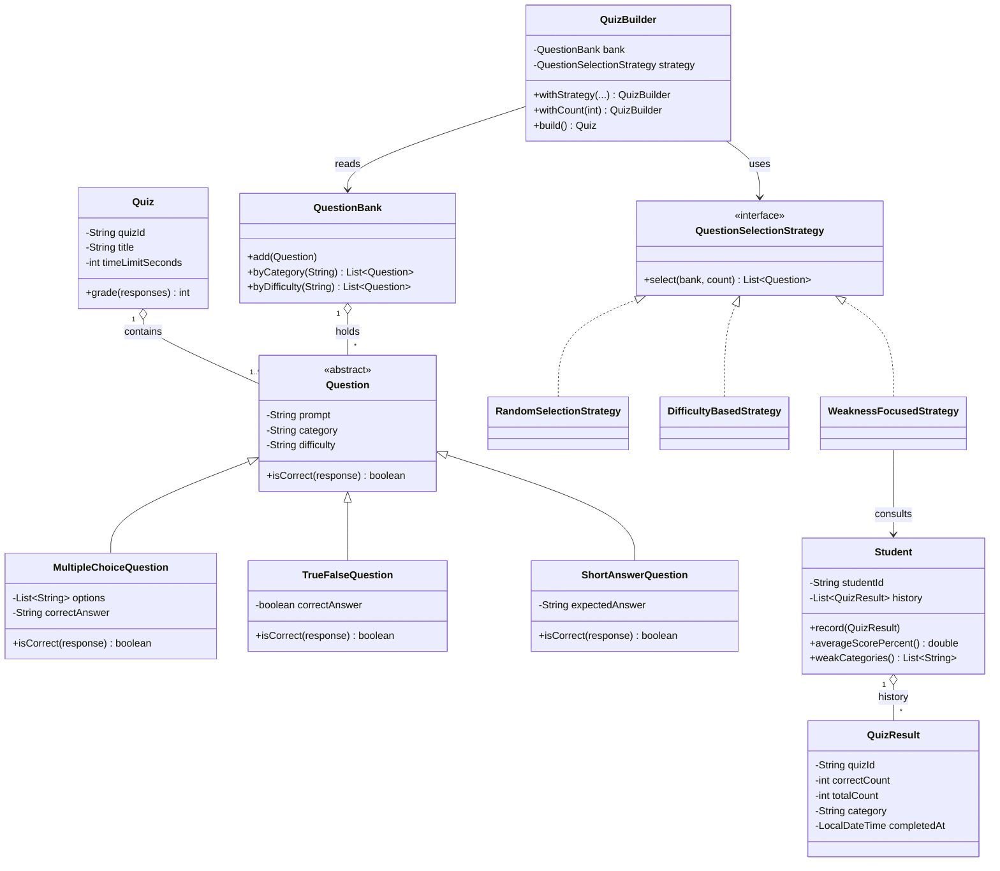

# UML Class Diagram

Rendered with Mermaid. GitHub renders this natively in the web view.
Satisfies the rubric requirement for a UML with ≥ 6 classes showing IS-A and HAS-A relationships.

## Core diagram

> **Note:** `Student` in this diagram maps to the class named
> `StudentPerformance` in the code — the diagram uses the shorter conceptual
> name for clarity, but the responsibilities and fields are identical.

## Relationship inventory (for report Section 3.1)

| Type | Instances |
|---|---|
| **IS-A** | `MultipleChoiceQuestion` / `TrueFalseQuestion` / `ShortAnswerQuestion` all extend `Question`. `RandomSelectionStrategy` / `DifficultyBasedStrategy` / `WeaknessFocusedStrategy` all implement `QuestionSelectionStrategy`. |
| **HAS-A (composition)** | `Quiz` has a list of `Question`. `QuestionBank` has a list of `Question`. `Student` has a list of `QuizResult`. |
| **HAS-A (association)** | `QuizBuilder` uses `QuestionBank` and `QuestionSelectionStrategy`. `WeaknessFocusedStrategy` reads from `Student`. |

Ten named classes appear in the diagram — comfortably above the rubric's
minimum of six.
